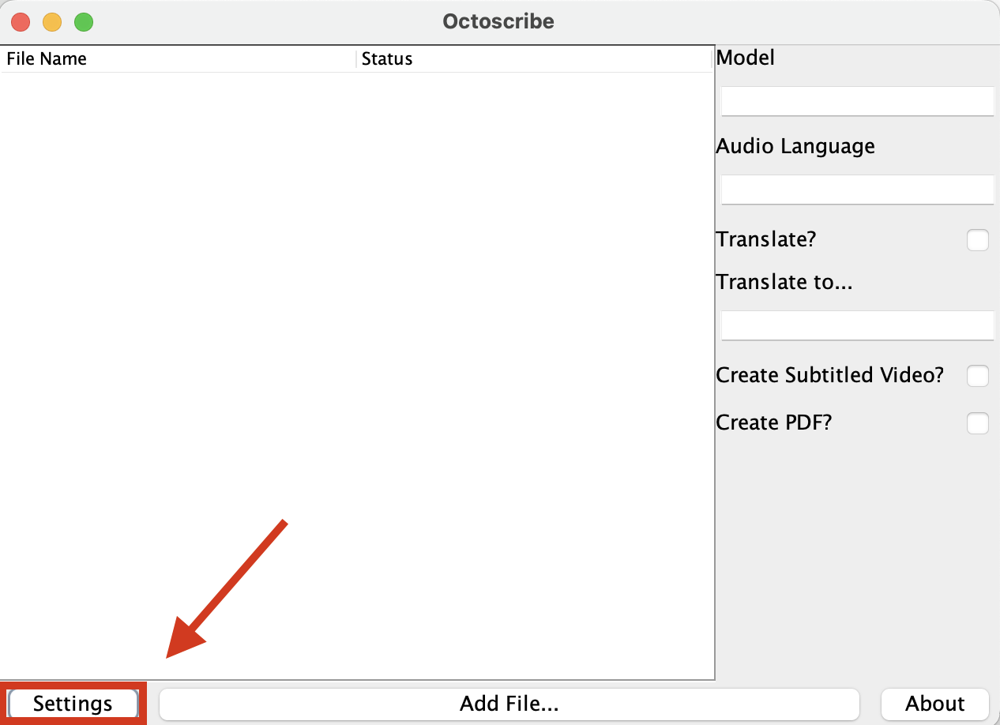
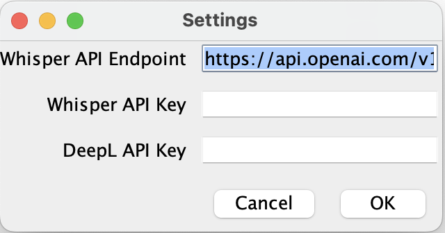
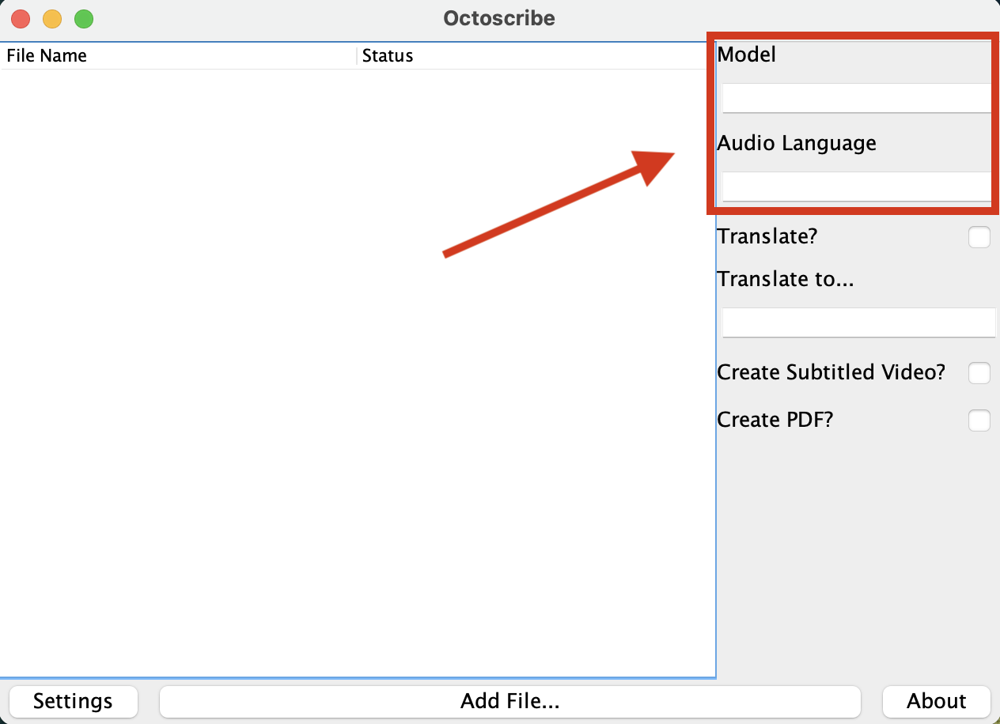
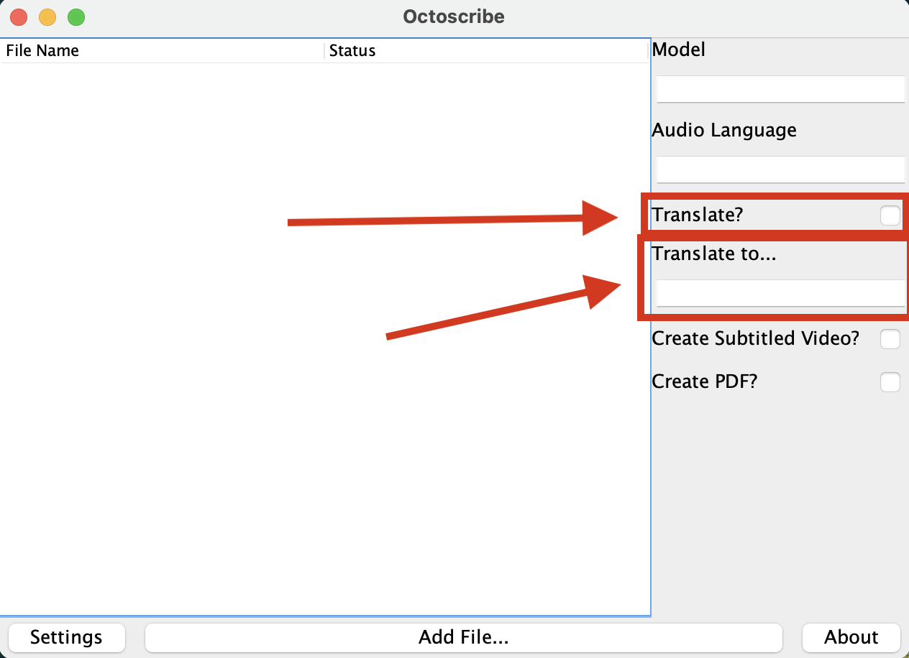
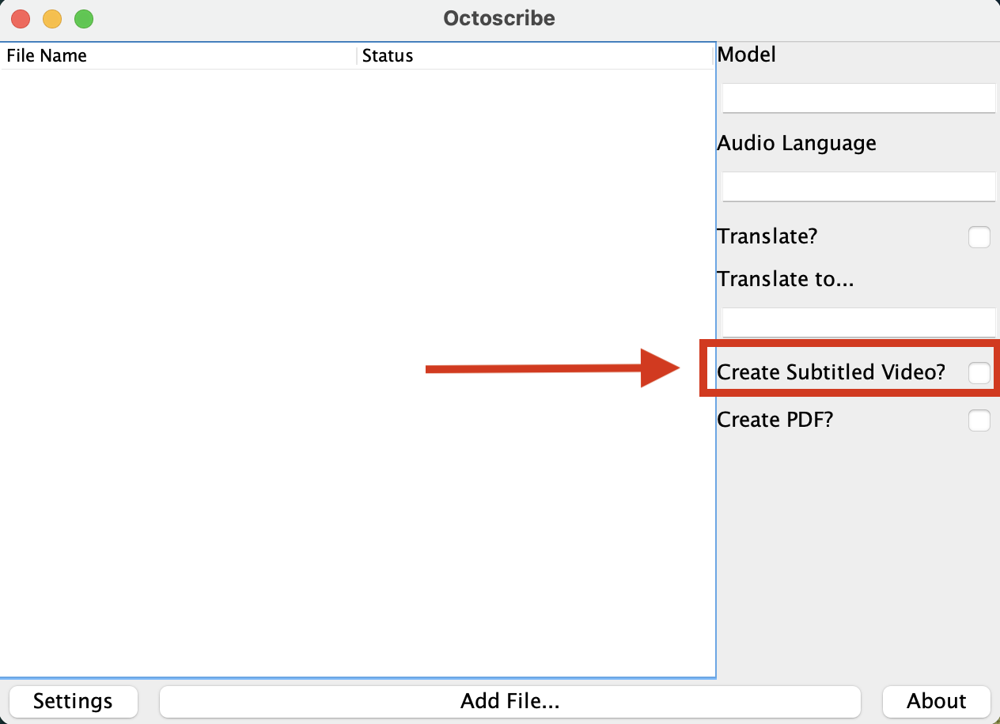
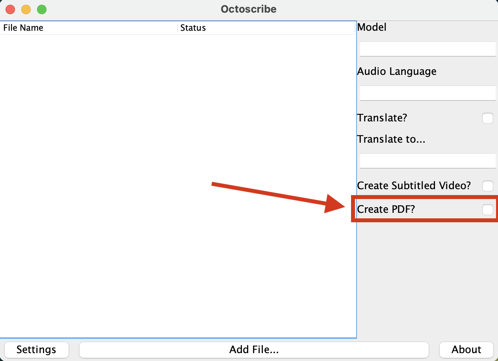
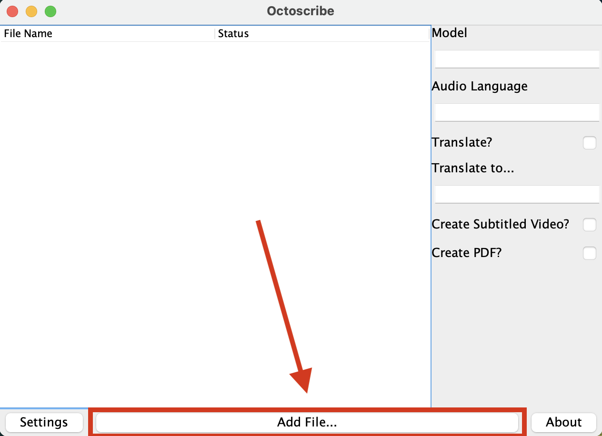

# Octoscribe

---

## Authors and Contributors
- Edison Zeng: [realSinewave](https://github.com/realSineWave)
- SeungHo Choi: [SHCAAA](https://github.com/SHCAAA)
- Nathan Li: [banxiafire](https://github.com/banxiafire)
- Evan Lee: [dogunee](https://github.com/Dogunee)

## What does this project do?
This program allows you upload a video and generate any the following:
1. The extracted Audio from the video
2. A transcript (.srt) file of what is said in the video
3. A pdf of the transcript
4. A translated transcript into a language of your choosing
5. A subtitled video

This program was created to allow users to easily create transcripts of videos and add subtitles, and is useful for 
anyone who requires subtitles on their video.

## Table of Contents
1. [Features](#features)
2. [Installation](#installation)
3. [Usage](#usage)
4. [License](#license)
5. [Feedback](#feedback)
6. [Contributions](#contributions)

## Features
- **Audio Extraction:** Upload a video file and extract its audio onto a mp3 file
- **Transcript Creation:** Upload an video or audio file and generate a transcript in the form of a .srt file 
- **Subtitle Generation:** Upload a video file and generate the same video with subtitles
- **Transcript Translation:** Upload a video or audio file and generate a translated transcription
- **PDF Generation:** Upload a video or audio file and generate a pdf containing the transcription

## Installation
### Prerequisites
- Operating System: Windows/MacOS/Linux (Don't know if this is true lol)
- Required Software and Packages:
    - FFmpeg: [Download Here](https://www.ffmpeg.org/download.html)

### Installation Steps

1. **Step 1:** Clone the repository from Github.
```bash
git clone https://github.com/realSineWave/Octoscribe.git
```
2. **Step 2:** Download FFmpeg from the link above
3. **Step 3:** Run Main.java
4. **Step 4:** Input API keys in the fellowing areas


   

## Usage
1. **Select model and the langauge of the file you will upload (It is recommended to leave these blank).**

   

3. **Toggle whether you want translated subtitles generated**



3. **Toggle whether you want to generated a subtitled video**



4. **Toggle whether you want to generate a PDF with the transcription**



5. **Add a video or audio file, and the program will automatically generate what you selected**



## License
This project is licensed under the [The MIT License](https://opensource.org/license/MIT).

This project includes or depends on these following project(s):

| Project                                                                               | License         |
| ------------------------------------------------------------------------------------- | --------------- |
| [FFmpeg/FFmpeg](https://www.ffmpeg.org/)                                              | LGPLv2.1, GPLv2 |

## Feedback
We welcome your feedback!
- Submit your feedback [here](https://docs.google.com/forms/d/e/1FAIpQLSe9SZl1695yW99S0Hx6U-1d1nf78ga5zvNP_-BJ50xL7BDOUg/viewform?usp=sf_link).
- Rules for feedback:
    - Be constructive.
    - Mention the specific issue that should be fixed.
    - For bugs, please include steps to reproduce any problems.

## Contributions

We welcome contributions to this project and encourage you to get involved! To contribute, start by forking the repository on GitHub and cloning it to your local machine. When your changes are ready, submit a pull request with a clear and concise description of the work done. Ensure your PR follows our merge request standards, which include proper code formatting, testing, and detailed commit messages. Once submitted, our team will review your PR according to the established review protocols, which include checking code quality, compatibility, and documentation updates. If contributions are currently closed, this will be indicated on the main page of the repository. Thank you for your interest in improving our project!

---
